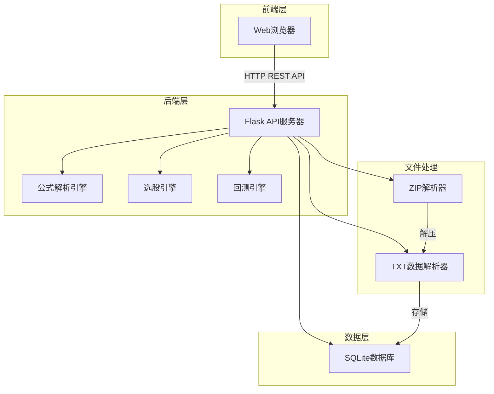

# A股回测系统技术设计文档

Feature Name: a-stock-backtest  
Updated: 2026-03-20

## 1. 系统概述

本系统是一个基于Web的A股回测平台，采用前后端分离架构。后端使用Python Flask框架，前端使用原生HTML/JavaScript，数据存储使用SQLite。

## 2. 系统架构



## 3. 技术栈

| 组件 | 技术选型 |
|------|----------|
| 后端框架 | Flask 2.x |
| 数据库 | SQLite3 |
| 前端框架 | 原生HTML/CSS/JavaScript |
| 图表库 | ECharts |
| PDF导出 | ReportLab |
| ZIP解析 | Python zipfile |
| 项目管理 | Poetry |

## 4. 目录结构

```
/workspace/
├── app/
│   ├── __init__.py          # Flask应用工厂
│   ├── config.py             # 配置文件
│   ├── models/
│   │   ├── __init__.py
│   │   └── stock.py          # 数据模型
│   ├── services/
│   │   ├── __init__.py
│   │   ├── data_service.py   # 数据导入服务
│   │   ├── formula_parser.py # 公式解析引擎
│   │   ├── stock_selector.py # 选股服务
│   │   └── backtest.py       # 回测引擎
│   ├── api/
│   │   ├── __init__.py
│   │   ├── data.py           # 数据管理API
│   │   ├── formula.py        # 公式API
│   │   ├── selector.py       # 选股API
│   │   └── backtest.py       # 回测API
│   └── utils/
│       ├── __init__.py
│       └── helpers.py        # 工具函数
├── static/
│   ├── css/
│   │   └── style.css         # 样式文件
│   └── js/
│       └── app.js            # 前端脚本
├── templates/
│   └── index.html            # 主页面
├── tests/
│   ├── __init__.py
│   ├── test_formula_parser.py
│   ├── test_stock_selector.py
│   └── test_backtest.py
├── data/                     # 数据目录
├── requirements.txt
├── pyproject.toml
└── README.md
```

## 5. 数据库设计

### 5.1 股票基础信息表 (stocks)

| 字段 | 类型 | 描述 |
|------|------|------|
| id | INTEGER PRIMARY KEY | 自增ID |
| code | VARCHAR(10) | 股票代码 |
| name | VARCHAR(50) | 股票名称 |
| created_at | DATETIME | 创建时间 |

### 5.2 股票日线数据表 (daily_data)

| 字段 | 类型 | 描述 |
|------|------|------|
| id | INTEGER PRIMARY KEY | 自增ID |
| stock_id | INTEGER | 股票ID（外键） |
| date | INTEGER | 交易日期（YYYYMMDD） |
| open | REAL | 开盘价 |
| high | REAL | 最高价 |
| low | REAL | 最低价 |
| close | REAL | 收盘价 |
| volume | REAL | 成交量 |

**索引**: (stock_id, date) 唯一索引

## 6. 公式解析引擎设计

### 6.1 词法分析器 (Lexer)

将公式字符串分解为Token序列。

**Token类型**:
- NUMBER: 数字（整数和浮点数）
- IDENTIFIER: 标识符（变量名、函数名）
- OPERATOR: 运算符（+、-、*、/、>、<、>=、<=、==、!=）
- LPAREN/RPAREN: 括号
- COMMA: 逗号
- EOF: 结束标记

### 6.2 语法分析器 (Parser)

基于Token序列构建AST。

**AST节点类型**:
- NumberNode: 数字常量
- VarNode: 变量引用
- BinaryOpNode: 二元运算
- FunctionCallNode: 函数调用

### 6.3 语义验证器 (Validator)

验证AST的语义正确性：
- 检查变量是否定义（OPEN、CLOSE、HIGH、LOW、VOLUME）
- 检查函数是否支持
- 检查函数参数类型和数量

### 6.4 公式执行器 (Evaluator)

给定股票数据，执行公式计算。

**支持的函数列表**:

| 函数名 | 参数 | 返回值 | 说明 |
|--------|------|--------|------|
| MA | (close, n) | REAL | N日简单移动平均 |
| EMA | (close, n) | REAL | N日指数移动平均 |
| MACD | (close, 12, 26, 9) | (diff, dea, bar) | MACD指标 |
| KDJ | (high, low, close, 9, 3, 3) | (k, d, j) | KDJ指标 |
| RSI | (close, n) | REAL | RSI指标 |
| BOLL | (close, n, k) | (upper, middle, lower) | 布林带 |
| VOLUME | () | REAL | 成交量 |
| CLOSE | () | REAL | 收盘价 |
| OPEN | () | REAL | 开盘价 |
| HIGH | () | REAL | 最高价 |
| LOW | () | REAL | 最低价 |

## 7. 选股引擎设计

### 7.1 选股流程

1. 获取用户选择的股票池和日期范围
2. 对每只股票：
   - 加载其历史数据
   - 使用公式执行器计算公式结果
   - 判断结果是否满足条件（非零或为真）
3. 汇总满足条件的股票
4. 返回选股结果

### 7.2 多条件组合

支持AND和OR两种组合方式：
- AND: 所有条件都满足
- OR: 任一条件满足

## 8. 回测引擎设计

### 8.1 回测参数

| 参数 | 默认值 | 说明 |
|------|--------|------|
| initial_capital | 100000 | 初始资金（元） |
| commission_rate | 0.0003 | 佣金率（万分之三） |
| slippage | 0.001 | 滑点（千分之一） |

### 8.2 回测信号

- 买入信号：公式结果从负转正或大于阈值
- 卖出信号：公式结果从小于阈值转负或达到止盈止损

### 8.3 回测指标计算

| 指标 | 计算公式 |
|------|----------|
| 总收益率 | (期末资产 - 初始资金) / 初始资金 * 100% |
| 年化收益率 | (1 + 总收益率)^(365/交易天数) - 1 |
| 夏普比率 | (策略收益率 - 无风险利率) / 策略收益率标准差 |
| 最大回撤 | max(最高点 - 最低点) / 最高点 * 100% |
| 胜率 | 盈利交易次数 / 总交易次数 * 100% |

## 9. API设计

### 9.1 数据管理API

#### POST /api/data/upload
上传并解析zip文件
- Request: multipart/form-data (file: zip文件)
- Response: {success: bool, message: string, stock_count: int}

#### GET /api/data/stocks
获取股票列表
- Response: {stocks: [{id, code, name, data_count}]}

#### DELETE /api/data/stocks/{id}
删除股票数据
- Response: {success: bool, message: string}

### 9.2 公式API

#### POST /api/formula/validate
验证公式语法
- Request: {formula: string}
- Response: {valid: bool, error: {line, col, message}?, ast: object}

#### POST /api/formula/execute
执行公式（单只股票）
- Request: {stock_id: int, formula: string, date: int}
- Response: {result: float, success: bool, error: string?}

### 9.3 选股API

#### POST /api/select
执行选股
- Request: {formulas: string[], date_start: int, date_end: int, combine_mode: "AND"|"OR"}
- Response: {results: [{stock_id, code, name, values}]}

### 9.4 回测API

#### POST /api/backtest/run
执行回测
- Request: {stock_ids: int[], formula: string, date_start: int, date_end: int, initial_capital: float, commission_rate: float, slippage: float}
- Response: {success: bool, metrics: {...}, trades: [...]}

#### GET /api/backtest/report/{id}
获取回测报告
- Response: {metrics: {...}, equity_curve: [...], trades: [...]}

#### GET /api/backtest/export/{id}
导出报告
- Query: format=pdf|csv
- Response: 文件下载

## 10. 前端页面结构

### 10.1 页面布局

```
+----------------------------------+
|           导航栏                  |
+----------------------------------+
|  数据管理  |  选股  |  回测  | 报告 |
+----------------------------------+
|                                  |
|          主内容区域               |
|                                  |
+----------------------------------+
```

### 10.2 数据管理页面

- 文件上传区域（拖拽支持）
- 导入进度显示
- 股票列表展示（分页）
- 删除按钮

### 10.3 选股页面

- 公式输入区域（多行支持）
- 日期范围选择器
- 组合模式选择（AND/OR）
- 选股按钮
- 结果表格展示

### 10.4 回测页面

- 股票选择器（多选）
- 公式输入框
- 回测参数配置
- 启动回测按钮
- 状态显示

### 10.5 报告页面

- 回测摘要卡片（收益率、夏普比率等）
- 累计收益曲线图（ECharts）
- 交易记录表格
- 导出按钮

## 11. 安全性考虑

- 文件上传大小限制（最大100MB）
- 支持的文件格式验证
- SQL注入防护（使用参数化查询）
- 用户输入消毒处理

## 12. 错误处理

| 错误类型 | HTTP状态码 | 响应格式 |
|----------|-----------|----------|
| 参数错误 | 400 | {error: "错误描述"} |
| 资源不存在 | 404 | {error: "资源不存在"} |
| 服务器错误 | 500 | {error: "内部错误"} |

## 13. 测试策略

### 13.1 单元测试

- 公式解析器测试（词法、语法、执行）
- 选股引擎测试
- 回测引擎测试

### 13.2 集成测试

- API端点测试
- 数据库操作测试

## 14. 依赖包

```
flask>=2.3.0
flask-cors>=4.0.0
sqlalchemy>=2.0.0
pandas>=2.0.0
numpy>=1.24.0
echarts>=5.0.0
reportlab>=4.0.0
python-dateutil>=2.8.0
```
